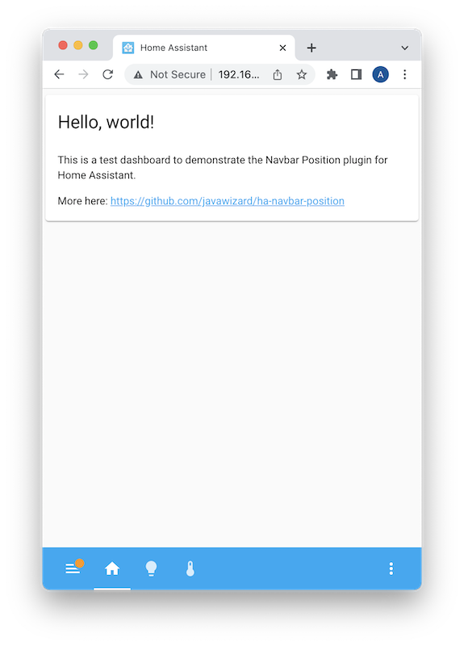

# Navbar Position

A Home Assistant frontend plugin that allows the navigation bar to be moved to the bottom of the screen.



# Installation

Install via HACS by searching for "Navbar Position".

Or install manually by dropping `ha-navbar-position.js` into your Lovelace dashboard resources.

# Usage

Right now this plugin is activated by adding `navbar=bottom` to the dashboard URL, like so:

```
http://<hass>:8123/some-dashboard/some-view?navbar=bottom
```

The navigation bar will be moved to the bottom of the screen until the next page refresh.

To save the navigation bar position to `localStorage` and move the navbar to the bottom automatically without having to specify `navbar=bottom` every time, use `navbar_cache`:

```
http://<hass>:8123/some-dashboard/some-view?navbar=bottom&navbar_cache
```

Thereafter, page loads that don't specify any `navbar` query parameters will default to moving the navbar to the bottom.

To clear the saved position and return the navbar to the top on future page loads, use `navbar_cache` without `navbar=...`:

```
http://<hass>:8123/some-dashboard/some-view?navbar_cache
```

There will likely be additional ways to configure this plugin in the future - pull requests gladly accepted.

# Limitations

The page is scanned every second to see if the header has appeared or has been replaced. This means that while switching between views within a single dashboard leaves the navbar at the bottom, **switching between dashboards or other pages in the Home Assistant UI will cause the navbar to jump back to the top for ~1 second when you return to a dashboard.** PRs gladly accepted to sprinkle some more `MutationObserver`s around to get rid of that delay.

This also only moves the dashboard navigation bar; it doesn't move navigation bars associated with any other screens. PRs welcome to handle that as well.

